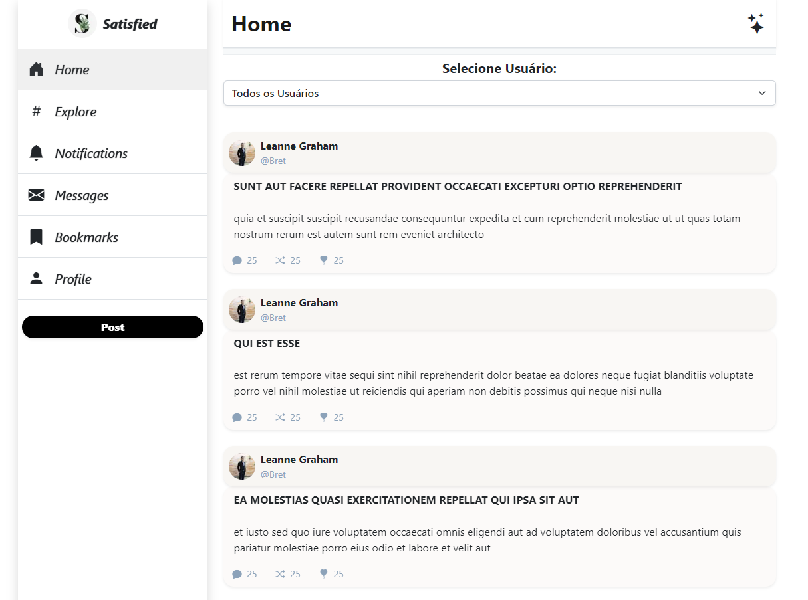

<div align="center"></div>
<h1 align="center"> Satisfied</h1>

<div  align="center">

### Os dados de usuários e postagens estão salvos na raiz do projeto com as seguintes nomenclaturas: dataUsers.json, dataPosts.json e dataComments.json
- estava com dificuldade de fazer a requisição dos dados, então criei um arquivo json com os dados e fiz a requisição dos dados do arquivo json
</div>
<br />
<br />
<h2 align="center">Alkabot-Test</h2>
<p align="center">Desenvolvendo um front-end para uma API RESTful. A interface deve exibir posts de um blog e, ao clicar em um post, os comentários associados. Interface criada do zero, usando dados aleatórios</p>
<p align="center">Foi Criada uma pagina Web que simula um redes de postagens(blog), onde os usuários podem ver as postagens de outros usuários e perfis</p>
<h1 align="center">
    <a href="https://nextjs.org/">🔗 Next.JS</a>
</h1>
<p align="center">🚀 lib para construir interfaces do usuário com componentes reutilizáveis</p>


<p align="center">
 <a href="#Features">Features</a> •
 <a href="#Pré-requisitos">Pré-requisitos</a> • 
 <a href="#tecnologias">Tecnologias</a> • 
 <a href="#autor">Autor</a> • 
 <a href="#licenc-a">Licença</a>
</p>
<h4 align="center"> 
	🚧  Next.JS Select 🚀 Em construção...  🚧
</h4>

### Features

- [x] Listar Usuários
- [x] Listar Usuários na pagina Profile
- [x] Listar Posts
- [x] Adicionando Comentários ao um Post Clicado
- [ ] Listar comentários do post

#

<h1 align="center">
  
</h1>

### Pré-requisitos

Antes de começar, você vai precisar ter instalado em sua máquina as seguintes ferramentas:
[Git](https://git-scm.com), [Node.js](https://nodejs.org/en/).
Além disto é bom ter um editor para trabalhar com o código como [VSCode](https://code.visualstudio.com/)

### 🎲 Rodando o Front-end (servidor)

```bash
# Clone este repositório
$ git clone <https://github.com/WisleyASousa/satisfied-alkabot-test.git>

# Instale as dependências
$ yarn

# Execute a aplicação em modo de desenvolvimento
$ yarn dev

# O servidor inciará na porta:3000 - acesse <http://localhost:3000>
```

### 🛠 Tecnologias

As seguintes ferramentas foram usadas na construção do projeto:

- [Next.JS](https://nextjs.org/)
- [Node.js](https://nodejs.org/en)
- [TypeScript](https://www.typescriptlang.org/)
- [Bootstrap](https://getbootstrap.com/)
- [Yarn](https://yarnpkg.com/)

### Autor

---

 
 <br />

<p>Wisley A. Sousa</p></sub></a> <a href="https://www.linkedin.com/in/wisley-a-sousa-843060a2/>🚀

Feito com ❤️ por Wisley A. Sousa 👋🏽 Entre em contato!

[](https://www.linkedin.com/in/wisley-a-sousa-843060a2/)

[](mailto:wisleya.sousa@outlook.com)

[](https://github.com/WisleyASousa/satisfied-alkabot-test/blob/main/License)
